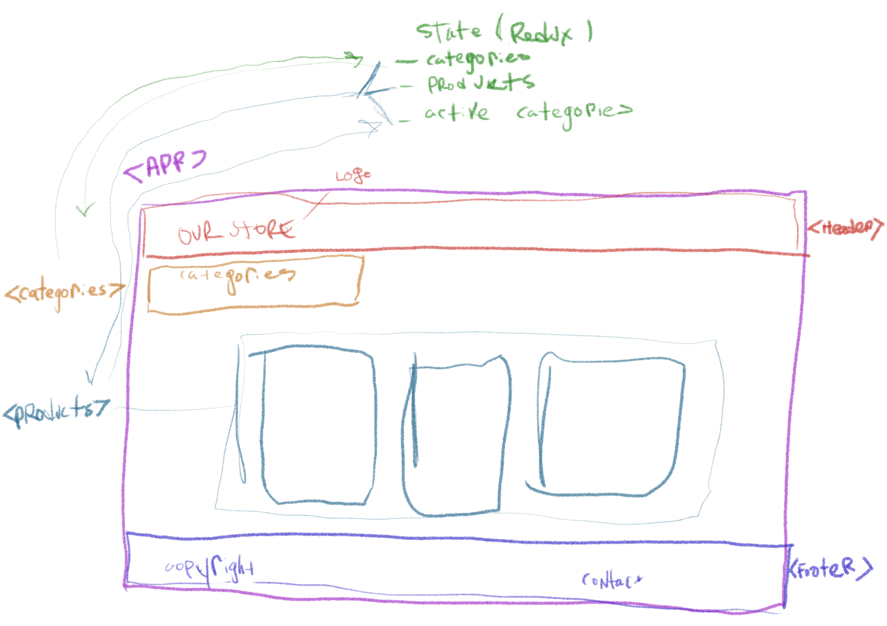
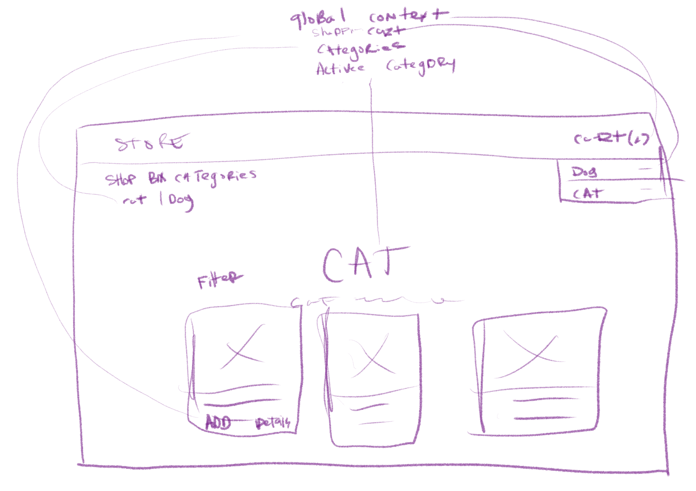

# Virtual Store
# Lab - Class 36

## Author: Tek Jones

## Deployment and test
  * [test report]()
  * [deployment lab36](https://codesandbox.io/s/long-resonance-wtuuk)
  * [deployment lab37](https://codesandbox.io/s/wonderful-nobel-lst0w)

## About
- Build of the storefront application
- Application State with Redux

## Setup

## Running the app
  * npm start

## Test
* npm test

### Phase 1
- our goal is to setup the basic scaffolding of the application with initial styling and basic behaviors. This initial build sets up the file structure and state management so that we can progressively build this application in a scalable manner.

### User Stories
- As a user, I expect to see a list of available product categories in the store so that I can easily browse products
- As a user, I want to choose a category and see a list of all available products matching that category
- As a user, I want a clean, easy to use user interface so that I can shop the online store with confidence

### Technical Requirements
- Create a visually appealing site using Material UI
- Use a Redux Store to manage the state of categories and items in the store
- Display a list of categories from state
- When the user selects (clicks on) a category …
- Identify that category as selected (change of class/display)
- Show a list of products associated with the category

## UML

---

### Phase 2
- We will be adding the “Add to Cart” feature to our application, which will allow our users to not only browse items in the store, but also select them and have them persist in their “shopping cart” for later purchase.

### User Stories
- As a user, I want to choose from products in the list and add them to my shopping cart
- As a user, I want to see the products that I’ve added to my shopping cart so that
- As a user, I want to change the quantity of items I intend to purchase in my shopping cart
- As a user, I want to be able to remove an item from my shopping cart

### Technical Requirements
- Continue to use Material UI Components for layout and styling
- Add a “Cart” indicator to the header, like this: Cart (0)
- Create a new Cart component to show the items in the user’s cart

## UML
